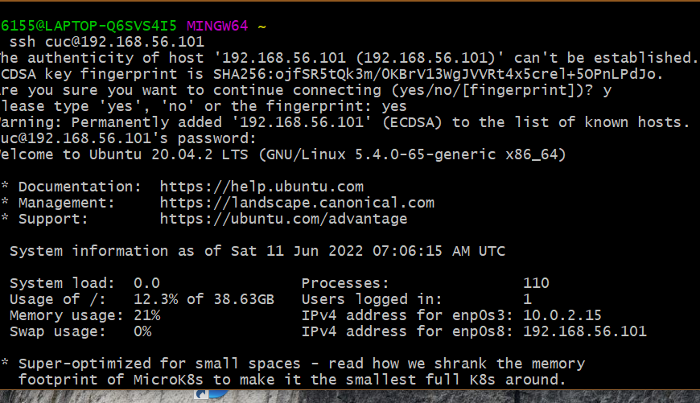

# 第一章：linux基础

## 实验软件环境

CentOS 7.7 

Ubuntu 20.04.02 Server 64bit

## 实验问题

调查并记录实验环境的如下信息

​	当前linux发行版本基本信息

​	当前linux内核版本信息

​	Virtualbox 安装完 Ubuntu 之后新添加的网卡如何实现系统开机自动启用和自动获取 IP？

​	如何使用 `scp` 在「虚拟机和宿主机之间」、「本机和远程 Linux 系统之间」传输文件？

​	如何配置 SSH 免密登录？

## 一、调查并记录实验环境

### 查询当前 Linux 发行版基本信息

#### 操作过程

通过LSB（Linux标准库）能够打印发行版的具体信息，包括发行版名称、版本号、代号等

操作代码：

`shell`

`lsb_release -a`

可以得到当前Ubuntu的发行版本代号为：20.04

### 查询当前 Linux 内核版本信息

操作过程

- uname（unix name 的意思） 是一个打印系统信息的工具，包括内核名称、版本号、系统详细信息以及所运行的操作系统等等。

  操作代码：

  `shell`

  `uname -a`

  

可知当前所用Ubuntu20.04的内核版本为：5.4.0-65-generic

## 二、Virtualbox 安装完 Ubuntu 之后新添加的网卡如何实现系统开机自动启用和自动获取 IP？

具体过程

网络配置

在 `NAT` 的基础上再开启另一块网卡 `Host-Only` ，使用 `netplan` 配置。

第一步，查询当前网卡使用情况

`shell`

`ip a`

第二步，修改配置文件并应用

`shell`

`sudo vim /etc/netplan/01-netcfg.yaml`

` sudo netplan apply`

打开自己的虚拟机查看，好像之前就弄好了

##  三、如何使用 scp 在「虚拟机和宿主机之间」、「本机和远程 Linux 系统之间」传输文件？

宿主机发到虚拟机

新建`test.txt`文件

发送 `scp C:\Users\86155\Desktop\22春季学期作业\linux\test.txt cuc@192.168.56.101:/home/cuc`

虚拟机发送到宿主机

查看要发送的文件  `cat`

修改要发送的文件 `vim`  按` I `键进行修改，按`esc`退出，`：wq`退出编辑器

发送文件

`scp cuc@192.168.56.101:/home/cuc/test.txt ./`

然后删除源文件。

使用scp实现「本机和远程 Linux 系统之间」传输文件：

首先登录阿里云平台，使用Linux指令入门-文件与权限的云服务场景，

输入`ip a`可查看弹性ip地址

弹性IP  106.14.72.225  密码 Av0Cl9Vf7Nj3  私有地址 172.16.20.33 用户 root

连接本机和云平台然后发送

`scp C:\Users\86155\Desktop\22春季学期作业\linux\666.txt root@106.14.72.225:/root`

云平台发送文件到主机

先查看云平台的文件 `ls`   顺手删除本机相应文件

修改云平台文件 `vim`

发送`scp root@106.14.72.225:/root/666.txt ./`

##  四、如何配置 SSH 免密登录？

具体过程

gitbash上进行的操作

`shell`

` ssh-keygen -t rsa`

提示输入东西的时候，连续按3次enter 就好，在~/.ssh目录 下生成了`id_rsa` 和`id_rsa.pub`两个文件，

复制公钥到虚拟机 `scp C:\Users\86155\.ssh\id_rsa.pub cuc@192.168.56.101:~/.ssh`

将公钥 复制为key文件 

没有成功，将公钥传输到虚拟机后，在虚拟机中找不到相应文件。我尽力了

## 第三步时没完成免密登录，所以需要按部就班的登录

## 输入命令时没有单独形成命令，用了ctrl+c恢复

## 复制时出了小问题，ctrl+v会出错，用了鼠标右键顺利进行

## 虚拟机在本地，而云端不在，所以从虚拟机传输文件到宿主机和从云端传输文件到本机的区别在于，前者加home，后者不加。

## 免密登录出问题了，公钥复制到虚拟机后，在虚拟机中没找到相应文件，导致后来没完成免密登录。

## 五、参考文献

1.[git常见问题fatal: Not a valid object name: 'master'.](https://www.cnblogs.com/fatfatdachao/p/5597028.html)

2.[解决 fatal: Not a git repository (or any of the parent directories): .git 问题](https://blog.csdn.net/wenb1bai/article/details/89363588)

3.[【Git】报错：“fatal: Could not read from remote repository”](https://www.jianshu.com/p/41b9d05687f4)

4.[【git常见问题】fatal: Not a valid object name: 'master'.](https://www.cnblogs.com/fatfatdachao/p/5597028.html)

